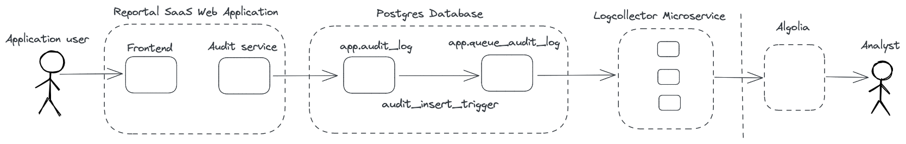

# Index BI data with Postgres on Algolia - Part 1

## Use Case

Hello I'm Mátyás Budavári, a software developer at Starschema.
This post is about the audit of one of our product, and how we can leverage the speed and distributed nature of [Algolia](https://www.algolia.com) to let our moderators search through the audit data without having access to the postgres database.

Our tool lets our enterprise users access to all their reports from different BI software and other resources in a centralized place. The most popular BI tools that we work with are [Tableau](https://www.tableau.com/) and [PowerBI](https://powerbi.microsoft.com/en-au/). BI tools help communicating, presenting and analyzing data with powerful interactive visualizations that can work even with realtime data.
Managing multiple data sources and dashboards is often a frustrating and time-consuming experience filled with noise that harms the ability to derive insights and leads to fallible decisions.

We developed a service to improve the data analysis and presentation process by enabling individuals or teams to curate and collaborate with customized shared workspaces.
Users can focus on analyzing data and communicating insights without having to shuffle between applications and authenticate multiple times.
The contents of these reports are still served from the original tools, we provide a unified experience on top of them. Our users can modify the visible name of these reports, add additional tags and other metadata that makes it easier for their teams to organize these reports.

We collect usage data periodically, that enables us to fine-tune the application based on how our users actually use it.
In addition to collecting these metrics we must comply to security requirements.
We need be able to tell who was able to access certain reports at a given point in time, what changes were made in the application by whom in a certain time range.
We collect so called audit logs to be able to extract these information.
This data must be handled with care and only people with higher privileges shall have access to the raw data.

In a recent project we needed to develop an optional extension to extract anonymized audit log information into an external place out of our PostgreSQL to let a team of content managers access that data quickly.
These audit logs can contain JSON metadata, it is hard to set up advanced search features in them with postgres, it's better to index that data to speed up the queries.

## What We Need

We need to have information about the usage distribution to present them to the creators of the reports inside the BI tools. We can show them detailed information on how their content is accessed through our application. Different tools might already collect and show usage data analytics, but this way we can show it in a unified manner.
Since the report creators often want to know the peak periods of their reports.

We need to have audit information to see what reports were accessed by whom through our application.
The external sources manage their own permissions, we synchronize them over to be transparent, but even if those lists differ the BI tools won't let unauthorized access to their reports.

## How can we achieve it

We mostly use our application in internal networks, protected network, most of the time out of strict policies it's not possible to connect dedicated analytics services.
We save our analytics data into our own database.
However most of the time our analytics team does not have access to the database.
We don't send out actual user data, and report metadata.
Though in some cases we are allowed to send out anonymized data, and let them know in a different channel what certain identifiers represent.

All in all, we need a way to query the usage logs fast without access to the original database.

We decided to use Algolia as the search index.
We don't want to host, manage and maintain our own search index service per installation, it's much better to have a managed centralized place where we can send our data.
Our focus groups can use to compose the reports they need based on the data sent over there.

Out of security and respect to our clients it's an opt-in feature.

## Architecture

Our backend service of the application is written in [Golang](https://go.dev/).
We store the connection information and report metadata for the BI Tools and the usage information in a [PostgreSQL](https://www.postgresql.org/) database.

We aim for a solution as close to the database as possible.
We'd like to leverage the language features that PostgreSQL provides us without any extensions.
And we don't want to modify our code too much to support this data gathering, though we're open to run small microservices that communicate with Algolia.

In order to send our data to Algolia, as of now, we need to write some kind of code outside PostgreSQL.

We want to create the data load component as a separate service with a single purpose to send data to the index.
Due to privacy of our users and reports we can not expose our database to the above mentioned external auditors, we can only send them a selected set of information.

## Proposed Solution

The audit log table can grow large over time in proportion to usage.
We don't want to query the whole log table every time we need to send out data.
It's better to have a small *queue* that takes care of the data load.
Each log line is necessary, but we can't rely on these small services to be available at any point in time, we have to persist what lines needed to be processed.

We plan to create a **new table** in PostgreSQL that stores the filtered data that is yet to be sent to Algolia.
This table will act as a LIFO (last-in-first-out) queue, to prioritize the new data over old ones.

We can send our already collected data into Algolia upon the creation of this new queue table.

We aim to **point a trigger** to the source table, and on every insert statement,
a PostgreSQL procedure copies the necessary fields into this new table.

We plan to **write a new service** that periodically reads the new table, gets the last few items and send them to Algolia.
It would be even better if multiple of such mini services could run at the same time without interrupting each other, and work on the queue independently.

> We're going to walk through a simplified implementation in the [next part](./part2.md).
